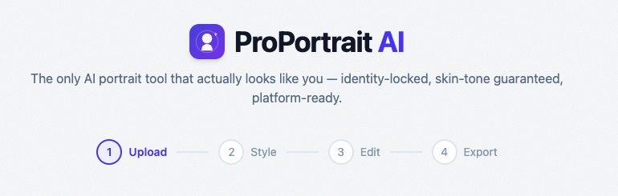

<div align="center">

</div>

# ProPortrait AI

AI-powered professional portrait generator built with React 19, Vite, Tailwind CSS 4, and Google Gemini.

Upload a photo and get studio-quality professional headshots in seconds — with full control over identity preservation, style, expression, and platform-specific export.

---

## Quick Start

### Prerequisites

- Node.js 18+
- A API key with access to `gemini-3.1-flash-image-preview`

### Setup

```bash
# Install dependencies
npm install

# Create env file
echo "GEMINI_API_KEY=your_key_here" > .env.local

# Start dev server (http://localhost:3000)
npm run dev
```

### Other Scripts

| Command | Description |
|---|---|
| `npm run build` | Production build to `dist/` |
| `npm run preview` | Preview production build locally |
| `npm run lint` | TypeScript type-check (no emit) |
| `npm run clean` | Remove `dist/` |

---

## Features

### Step 1 — Upload & Identity Controls

- Upload any photo (single person or group)
- **Group photo support**: Select which person to generate from — Single person, Left, Center, Right, or a custom free-text description
- **Identity Locks** — per-feature preservation toggles (eye color and skin tone locked by default):
  - Eye color — default: ON
  - Skin tone (with precise undertone matching) — default: ON
  - Hair length — default: ON
  - Hair texture & curl pattern — default: OFF
  - Glasses — default: OFF
- **Likeness strength** slider (0–100): controls how strictly facial features are replicated (default: 70)
  - 0–49: moderate identity fidelity
  - 50–79: high identity fidelity
  - 80–100: very strict identity fidelity
- **Naturalness** slider (0–100) with presets:
  - Natural (15) — preserve all texture, pores, variation
  - Polished (50) — light professional retouching (default)
  - Studio (85) — full high-end smoothing
- **Blemish removal** toggle — removes spots, acne, dark circles without altering identity (ON by default)

### Step 2 — Style & Expression

**16 portrait styles:**

| Style | Description |
|---|---|
| Corporate | Executive headshot, tailored suit, office background |
| Creative | Personal brand, smart-casual, artistic backdrop |
| Studio | Classic Rembrandt lighting, gray canvas |
| Tech | Modern tech leader, blazer + tee, bright office |
| Outdoor | Environmental portrait, urban park, warm daylight |
| B&W | Fine-art black and white, rich tonal range |
| Vintage | 1950s–60s Kodachrome film look |
| Cinematic | Movie-quality close-up, subtle teal/orange grade |
| Cartoon | Pixar/Disney 3D animated character style |
| Art Deco | 1920s glamour, geometric gold patterns |
| LinkedIn | Optimized profile headshot, neutral background |
| Resume | Conservative CV headshot, clean white/gray |
| Speaker | Conference keynote presenter, high-impact |
| Dating | Warm, candid dating profile portrait |
| Academic | Faculty/researcher, scholarly backdrop |
| Creative Industry | Editorial portfolio, distinctive personal style |

**5 expression presets** (default: Confident Neutral):

| Preset | Description |
|---|---|
| Natural | Let the AI choose |
| Confident Neutral | Relaxed, professional, no forced smile |
| Warm Smile | Genuine Duchenne smile, friendly |
| Serious Authority | Composed, direct, executive gravitas |
| Approachable Expert | Subtle confident smile, competence + warmth |

**Number of variations**: 2 or 4 images generated in parallel.

**Identity Confidence Score** — displayed in Step 2, color-coded:
- Green (70%+): High
- Amber (40–70%): Medium
- Red (<40%): Low
- Score = `likenessStrength × 0.4 + (locked features / 5) × 40 + (100 − naturalness) × 0.2`

**Copy Settings JSON** — copies all current generation settings as a JSON preset for team sharing.

### Step 3 — Editing Studio

- **Before/After comparison slider** — drag to compare original vs AI portrait
- **Regional edit mode** — target specific areas with quick presets:
  - **Clothes**: Dark Business Suit, Tuxedo, Casual T-Shirt, Leather Jacket, Turtleneck, White Dress Shirt, Navy Blazer, Hoodie
  - **Background**: Solid White, Solid Grey, Soft Gradient, Modern Office, Brick Wall, Abstract Studio, City Skyline, Natural Outdoors, Library, Transparent
  - **Color**: Black and White, Warm Golden Tones, Cool Blue Tones, Cinematic Teal & Orange, Vintage Sepia, Soft Pastel, High Contrast
  - **Region**: Lock to a custom area (free text) before applying any instruction
- **Custom instruction** — free-text input to apply any edit
- **Visual history strip** — thumbnail timeline of all edits; click any state to jump back
- **Undo / Redo** with step counter

> Applying the **Transparent** background preset automatically switches the export format to PNG.

### Step 4 — Export

- **Aspect ratio**: 1:1 or 3:4
- **Format**: JPG (free) or PNG (Pro — required for transparent background)
- **Fit mode**: Fill (crop to exact size) or Fit (letterbox with blurred background)
- **Crop position**: X/Y percentage sliders for precise framing
- **Platform presets** — one-click download at exact platform dimensions:

| Platform | Size | Aspect |
|---|---|---|
| LinkedIn | 800×800 | 1:1 |
| GitHub | 500×500 | 1:1 |
| X / Twitter | 400×400 | 1:1 |
| Instagram | 320×320 | 1:1 |
| Resume / CV | 600×800 | 3:4 |

- **Download All Platforms** — sequential batch download of all five presets

### Pro Tier

| Feature | Free | Pro |
|---|---|---|
| JPG export | ✅ | ✅ |
| PNG / lossless export | — | ✅ |
| Export resolution | 1024px | 2048px |
| Platform batch download | ✅ | ✅ |

---

## Project Structure

```
src/
├── components/
│   ├── PortraitGenerator.tsx   # Main 4-step wizard UI (~1200 lines)
│   ├── ComparisonSlider.tsx    # Before/after drag comparison
│   ├── PrivacyNotice.tsx       # Dismissible privacy banner
│   └── ApiKeyGuard.tsx         # API key check/selection wrapper
├── services/
│   └── ai.ts                   # Gemini AI service (generation + editing)
├── lib/
│   ├── platformPresets.ts      # Platform export configurations
│   └── utils.ts                # cn() Tailwind utility
├── App.tsx                     # Root — wraps PortraitGenerator in ApiKeyGuard
└── main.tsx
```

### ApiKeyGuard

`ApiKeyGuard` wraps the entire app and ensures an API key is available before rendering. In AI Studio it uses `window.aistudio.hasSelectedApiKey()` / `window.aistudio.openSelectKey()`. In local dev it falls back to `process.env.GEMINI_API_KEY`.

---

## AI Service API

### `generateProfessionalPortrait`

```ts
generateProfessionalPortrait(
  imageBase64: string,        // base64-encoded image data
  mimeType: string,           // e.g. "image/jpeg"
  style?: StyleOption,        // default: 'corporate'
  likenessStrength?: number,  // 0–100, default: 70
  numImages?: number,         // 2 or 4, default: 2
  identityLocks?: IdentityLocks,
  naturalness?: number,       // 0–100, default: 50
  expressionPreset?: ExpressionPreset,  // default: 'confident_neutral'
  selectedPersonHint?: string | null,  // 'left' | 'center' | 'right' | custom
  removeBlemishes?: boolean,  // default: true
): Promise<string[]>          // array of data: URIs
```

Returns an array of base64 data URIs (one per requested variation). When `removeBlemishes` is `true`, a second AI retouch pass runs after generation — this doubles API calls but preserves identity while improving skin quality.

### `editProfessionalPortrait`

```ts
editProfessionalPortrait(
  imageBase64: string,     // base64-encoded image (PNG)
  instruction: string,     // natural language edit instruction
  regionOnly?: string,     // restrict edit to this region only
): Promise<string>         // single data: URI
```

Applies a targeted edit while preserving facial identity. Pass `regionOnly` (e.g. `"background"`, `"clothing"`) to restrict changes to a specific area.

### Types

```ts
type IdentityLocks = {
  eyeColor: boolean;    // default: true
  skinTone: boolean;    // default: true
  hairLength: boolean;  // default: true
  hairTexture: boolean; // default: false
  glasses: boolean;     // default: false
};

type ExpressionPreset =
  | 'natural'
  | 'confident_neutral'   // default
  | 'warm_smile'
  | 'serious_authority'
  | 'approachable_expert';

type StyleOption =
  | 'corporate' | 'creative' | 'studio' | 'tech' | 'outdoor'
  | 'bw' | 'vintage' | 'cinematic' | 'cartoon' | 'art_deco'
  | 'linkedin' | 'resume' | 'speaker' | 'dating' | 'academic'
  | 'creative_industry';
```

---

## Environment Variables

| Variable | Required | Description |
|---|---|---|
| `GEMINI_API_KEY` | Yes (local dev) | Google AI API key |
| `API_KEY` | Yes (local dev) | Alias for `GEMINI_API_KEY` — either works |
| `GEMINI_MODEL` | No | Override model (default: `gemini-3.1-flash-image-preview`) |

In AI Studio, the API key is selected through the UI via `ApiKeyGuard` and does not require a `.env.local` file.

---

## Tech Stack

| Layer | Technology |
|---|---|
| UI framework | React 19 |
| Build tool | Vite 6 |
| Styling | Tailwind CSS 4 |
| Animation | Motion |
| Icons | Lucide React |
| AI | Google Gemini (`@google/genai`) |
| Canvas export | Native browser Canvas API |
| Language | TypeScript 5.8 |

---

## Privacy

Photos are sent directly to Google Gemini's API for processing. No images are stored server-side by this application. Users are shown a dismissible privacy notice on the upload screen explaining this before any photo is submitted.

---

## Development Notes

- All image generation uses aspect ratio `3:4` at `1K` resolution via the Gemini image config
- Skin tone preservation is baked into every prompt with explicit "no darkening / no lightening" guards
- Lighting guards prevent dark or moody output regardless of style
- Age preservation guards prevent unintended aging artifacts
- Group photo hint injects a `CRITICAL: Use ONLY the person [position]` directive at the top of the prompt
- Platform downloads use the browser's Canvas API to render at exact pixel dimensions; JPEG output uses 0.95 quality
- Fill mode crops to exact dimensions using X/Y crop position; Fit mode letterboxes with a blurred background fill
