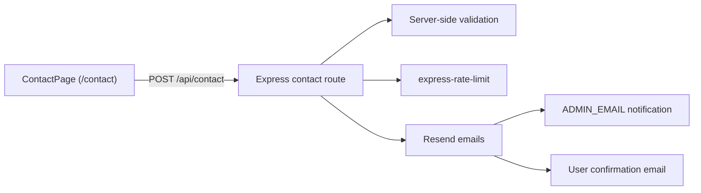

# Contact Us Page Guide

This document describes the `Contact` page implementation for this repository. It is intentionally aligned with the current codebase and existing production stack.

## Overview

The Contact page is a public-facing page at `/contact` that lets visitors send a message to the ProPortrait AI team.

First-pass scope:

- Public route, no login required
- Responsive two-column layout using the same public-site design language as the landing page
- Fields: `name`, `email`, `company`, `reason`, `message`
- Client-side HTML validation plus explicit server-side validation
- Rate-limited Express endpoint
- Email delivery and admin notification through Resend
- No file uploads
- No Firestore persistence in v1

## Current Stack

The Contact flow should use the technologies already present in this repo:

- Frontend: React 19 + TypeScript + Vite 6
- Styling: Tailwind CSS 4
- Backend: Express
- Email: Resend
- Existing platform services: Firebase Auth, Firestore, Stripe, Cloudflare R2

This repo does not use React Router, tRPC, Prisma, PostgreSQL, GCS, Nodemailer, or Zod for this feature.

## Architecture



## Frontend Implementation

### Route Handling

Routing is handled manually in `src/App.tsx` by checking `window.location.pathname`.

- `path === '/contact'` renders `ContactPage`
- Unknown public paths still fall back to `LandingPage`

### Page Component

Primary file:

- `src/components/ContactPage.tsx`

The page follows the same public shell pattern already used by:

- `src/components/LandingPage.tsx`
- `src/components/PrivacyPage.tsx`
- `src/components/TermsPage.tsx`

### Layout

- Header with logo, public navigation, and `Start free` CTA
- Left column with response expectations, support messaging, and dedicated legal/privacy email links
- Right column with the form card
- Success state replaces the form after a successful submission

### Form Fields

- `name`: required, 2-100 chars
- `email`: required, valid email, max 160 chars
- `company`: optional, max 120 chars
- `reason`: required select
- `message`: required, 10-2000 chars

### Contact Reasons

- `general`
- `support`
- `billing`
- `partnership`
- `feature`
- `bug`
- `other`

### Submission Pattern

The page uses local React state and plain `fetch`, matching the rest of the app:

```ts
const API_BASE = (import.meta.env.VITE_API_URL as string | undefined) ?? '';

await fetch(`${API_BASE}/api/contact`, {
  method: 'POST',
  headers: { 'Content-Type': 'application/json' },
  credentials: 'include',
  body: JSON.stringify(form),
});
```

## Backend Implementation

Primary files:

- `server/routes/contact.ts`
- `server/index.ts`

### Route

- `POST /api/contact`

This route is separate from `POST /api/email/capture`.

That separation is important:

- `/api/email/capture` remains the lightweight lead-capture endpoint used by `EmailCapture.tsx`
- `/api/contact` handles full contact-form submissions

### Validation Rules

Server validation is explicit and lightweight:

- name length check
- email regex validation
- company max length check
- allowlist validation for `reason`
- message length check

### Rate Limiting

`express-rate-limit` is applied directly to the contact route.

Default behavior:

- 5 submissions per 15 minutes per IP

### Email Behavior

The route reuses the same Resend configuration pattern already present in the repo:

- `RESEND_API_KEY`
- `RESEND_FROM_EMAIL`
- `ADMIN_EMAIL`

When Resend is configured:

- send an admin notification to `ADMIN_EMAIL`
- set `replyTo` to the submitter's email
- send a confirmation email back to the submitter

When Resend is not configured:

- log the submission to the server console
- still return `ok: true` so local development is not blocked

## Legal And Specialized Channels

The Contact page is for general support and business inquiries.

Do not merge these into the general form flow:

- Privacy and data requests: `privacy@portrait.ai-biz.app`
- Terms or legal questions: `legal@portrait.ai-biz.app`
- DMCA notices: `dmca@portrait.ai-biz.app`

Those addresses should remain visible on the legal pages and can also be referenced on the Contact page.

## Persistence Decision

Version 1 does not persist contact submissions in Firestore.

Reasoning:

- The current repo does not have a contact-request data model yet
- Email delivery is enough for the first pass
- This avoids introducing partial storage logic without an admin workflow

Recommended follow-up if persistence becomes necessary:

- store contact submissions in Firestore
- add admin review tooling or export workflow
- keep Resend notification as the first alerting path

## Environment Variables

No new environment variables are required for the first pass.

Existing variables already support the flow:

- `RESEND_API_KEY`
- `RESEND_FROM_EMAIL`
- `ADMIN_EMAIL`
- `VITE_API_URL` in production

## Files Involved

- `src/components/ContactPage.tsx`
- `src/components/LandingPage.tsx`
- `src/App.tsx`
- `server/routes/contact.ts`
- `server/index.ts`
- `docs/contact-us.md`

Optional supporting updates:

- `README.md`
- `public/sitemap.xml`

## Testing Checklist

- Load `/contact` directly in the browser
- Verify navigation from the landing page to `/contact`
- Submit a valid form and confirm the success state appears
- Submit invalid input and confirm user-friendly errors are returned
- Verify rate limiting after repeated submissions
- Confirm `/api/email/capture` still works independently
- Confirm privacy/legal/DMCA addresses remain unchanged
- Run `npm run lint`

## Future Enhancements

- Firestore persistence for contact submissions
- Admin view for inbound contact requests
- Spam scoring or captcha if abuse appears
- Analytics event tracking for form opens and submissions
- Multi-language copy if the public site expands

---

Last updated: 2026-03-06
