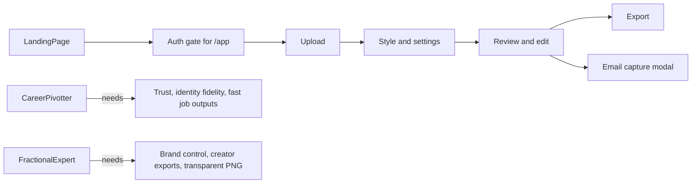

# ProPortrait AI — ICP Experience Audit

> Version: 1.0
> Date: March 2026
> Inputs: `docs/ICP.md`, `src/components/PortraitGenerator.tsx`, `src/lib/platformPresets.ts`, `docs/style.md`

---

## Purpose

This document reviews the current portrait-generation experience through the lens of the two ICPs in `docs/ICP.md`:

1. The Career Pivotter
2. The Fractional Expert

The goal is to identify:

- what already works for each persona
- what is missing or poorly surfaced
- what should be improved first without conflicting with the current product architecture

This audit is grounded in the current implementation, not the idealized product vision.

---

## Current Generation Flow

The live flow is primarily implemented in `src/components/PortraitGenerator.tsx`.

### Step 1 — Upload

Current experience:

- Upload one JPG, PNG, or WEBP
- Immediate validation for file size and type
- Tips for "Best Results" and "Avoid"
- User advances directly to Step 2 after selecting a file

Observations:

- This step is visually clean and low-friction once the user is inside the app
- Privacy reassurance exists as a reusable component in `src/components/PrivacyNotice.tsx`, but it is not currently shown in the generation flow

### Step 2 — Style & Settings

Current experience:

- Quick mode exposes 3 styles: `editorial`, `environmental`, `candid`
- Advanced mode exposes 7 styles total
- Group photo targeting exists in Advanced mode
- Expression presets exist in Advanced mode
- Identity locks exist in Advanced mode
- Likeness strength, naturalness, blemish removal, and variations exist in Advanced mode

Observations:

- The core controls are powerful
- The strongest trust and intent-matching controls are hidden behind Advanced mode
- User-facing style labels prioritize visual clarity and consolidation over persona-specific language

### Step 3 — Review & Edit

Current experience:

- Variation switching
- Before/after comparison slider
- Undo/redo and edit history
- Background editing
- Clothing editing
- Regional edit targeting
- Custom prompt field and prompt history

Observations:

- This is the strongest part of the product for power users
- It supports refinement, iteration, and quality control very well
- Some persona-critical goals, like transparent PNG or brand-fit editing, are possible but not framed early enough

### Step 4 — Export

Current experience:

- Export ratio: `1:1` or `3:4`
- Layout mode: fill or fit
- PNG/JPG export
- Platform presets: LinkedIn, GitHub, X/Twitter, Instagram, Resume
- Download All ZIP
- Save to library
- Upgrade prompts for Pro-only value

Observations:

- Export is useful but still generic
- Persona-specific surface destinations are incomplete
- Some of the most valuable outputs are collapsed in Quick mode behind "More Export Options"

### Cross-Flow Behavior

- `/app` requires login in `src/App.tsx`
- The backend supports anonymous session fallback in `server/middleware/authMiddleware.ts`
- `EmailCapture` is triggered after successful generation
- Free users receive a watermark through `server/lib/watermark.ts`
- E2E coverage is very thin and only verifies Step 1 and the transition into Step 2

---

## Experience Map

---

## ICP 1 — The Career Pivotter

### What Already Works Well

- Identity locks directly address AI trust anxiety
- Before/after comparison helps answer "do I still look like myself?"
- Resume export already exists
- LinkedIn export already exists
- The default professional style cluster is credible enough for many job-search use cases
- Speed is strong once the user is in the generator

### What Feels Misaligned Today

#### 1. Login comes before first value

The persona is urgency-driven and skeptical. Requiring auth before `/app` creates unnecessary commitment before trust is earned, even though the backend already supports anonymous sessions.

Why it matters:

- increases bounce risk for laid-off or interview-prep users
- weakens the "fast fix" promise

#### 2. Identity locks are hidden behind Advanced mode

This is the main category objection handler for this ICP, but the UI treats it like a secondary setting.

Why it matters:

- trust-building appears optional instead of central
- users may generate once without understanding the product's differentiator

#### 3. Style language is not job-search specific enough

The ICP thinks in terms like:

- LinkedIn
- Resume
- Corporate fallback
- promotion-ready
- senior-level presence

The current style labels are:

- Editorial
- Environmental
- Candid

These are visually useful but not outcome-oriented for this persona.

#### 4. Default expression is slightly off

The Career Pivotter wants "confident neutral." The current default is `warm_smile`.

Why it matters:

- may feel too eager for senior roles
- increases likelihood that a job-search user needs manual adjustment before generating

#### 5. Privacy reassurance is weaker than the ICP requires

The ICP explicitly needs privacy assurance before upload. The component exists, but the reassurance is not visible in the actual Step 1 flow.

#### 6. Job-critical exports are treated like advanced options

LinkedIn and Resume are core outcomes for this ICP, not secondary export details.

#### 7. Post-generation email capture interrupts the urgent workflow

Once the user gets a result, they want to export and update their professional surfaces immediately.

#### 8. Free watermark may reduce immediate usability

For a user trying to ship a profile update quickly, the watermark adds friction to the "I can use this right now" moment.

### Missing or Underdeveloped For This Persona

- persona-specific entry such as `Update LinkedIn`, `Need a resume photo`, `New manager-level role`
- a visible "trust bundle" before generation
- explicit job-search presets or labels
- proactive compare guidance for identity validation
- a tighter first-run path optimized for speed and confidence

### Best Improvements For The Career Pivotter

1. Add a job-search intent entry before style selection
2. Surface identity locks in the default path, not only Advanced
3. Rename or reframe styles for job outcomes, even if prompts stay consolidated underneath
4. Default to `confident` expression for job-search intent
5. Show the privacy notice before upload
6. Promote LinkedIn and Resume outputs in Step 4
7. Delay email capture until after export

---

## ICP 2 — The Fractional Expert

### What Already Works Well

- Background editing is highly relevant
- Transparent background capability exists
- History and undo/redo support iterative refinement
- Multiple variations support exploration
- Copy Settings JSON fits operator-minded users
- Export flow supports multiple surfaces better than a one-off headshot product

### What Feels Misaligned Today

#### 1. The language this persona cares about has been abstracted away

The ICP thinks in terms like:

- Speaker
- Creative Industry
- Approachable Expert
- independent authority

The current product intentionally consolidated those labels into broader prompt families.

This makes sense for reducing option overload, but it also removes important semantic cues for this persona.

#### 2. Transparent background is treated as a late edit, not an up-front goal

For the Fractional Expert, transparent PNG is often a hard requirement for Canva, Figma, websites, and speaker materials.

Why it matters:

- a critical workflow requirement is buried in Step 3
- the user may not realize the product supports one of their strongest purchase drivers

#### 3. Export presets are too generic

Current presets cover:

- LinkedIn
- GitHub
- X / Twitter
- Instagram
- Resume

This misses high-value creator surfaces such as:

- website hero portrait
- speaker bio
- podcast thumbnail
- newsletter avatar
- transparent PNG for design files

#### 4. Multi-style experimentation is not strong enough

This ICP wants to compare brand directions, not just multiple outputs of one selected style.

The current product supports variation comparison within one style, but not side-by-side style strategy comparison.

#### 5. Default settings skew slightly too polished/general

The Fractional Expert often wants:

- lower smoothness
- stronger texture retention
- non-corporate but still credible positioning

The current defaults are broad-market defaults, not creator/consultant defaults.

#### 6. Brand-fit editing is possible but not framed as a first-class workflow

The background editing tools are strong, but they are not explicitly packaged around "match my brand" or "speaker-ready."

#### 7. Email capture appears at the wrong moment

This persona is often in launch mode or asset-production mode. Post-generation interruption breaks momentum.

### Missing or Underdeveloped For This Persona

- creator/fractional-specific onboarding path
- transparent PNG positioned as a headline benefit
- export presets for creator and speaker workflows
- multi-style compare across brand directions
- brand-language labels that match how the user evaluates outcomes

### Best Improvements For The Fractional Expert

1. Add an intent path such as `Speaker / Consultant` or `Brand refresh`
2. Restore creator-relevant labels at the UI level, even if prompts stay consolidated underneath
3. Promote transparent PNG earlier in the flow
4. Add creator export presets
5. Add side-by-side style comparison across 2 to 3 strategic looks
6. Create clearer background presets framed around brand aesthetics
7. Move email capture after export completion

---

## Comparative Summary

| Dimension | Career Pivotter | Fractional Expert |
|---|---|---|
| Main job to be done | Look ready for the next role now | Maintain and refresh a multi-surface brand asset |
| Biggest current strength | Identity control + job exports | Editability + transparent/design workflows |
| Biggest current weakness | Too much trust value hidden behind Advanced mode | Too much creator-specific value hidden behind generic labels |
| Main UX problem | Product feels too generic and slightly too gated | Product feels capable but not intentionally creator-first |
| Most important quick fix | Surface identity locks and privacy earlier | Surface transparent PNG and creator labels earlier |

---

## Prioritized Improvement Roadmap

### Priority 1 — Persona-aware entry and defaults

Highest impact because it changes framing without requiring a full backend redesign.

Recommended additions:

- Job search
- LinkedIn refresh
- Speaker / Consultant
- Brand refresh

What this should control:

- starting style
- default expression
- naturalness preset
- identity-lock emphasis
- suggested export destinations

Why first:

- solves the biggest positioning problem for both ICPs
- mostly frontend work in `src/components/PortraitGenerator.tsx`

### Priority 2 — Surface trust and intent-critical controls earlier

Recommended changes:

- show privacy notice before upload
- surface identity locks in the default path
- surface transparent PNG earlier for creator-oriented paths

Why second:

- directly addresses objection handling
- low engineering risk
- reuses existing building blocks

### Priority 3 — Expand export presets to match real surfaces

Recommended additions:

- Website Hero
- Speaker Bio
- Podcast / YouTube Thumbnail
- Newsletter Avatar
- Design-ready Transparent PNG

Why third:

- directly supports the Fractional Expert
- strengthens the Career Pivotter's multi-platform story too
- mostly scoped to `src/lib/platformPresets.ts` and export UI

### Priority 4 — Support style strategy comparison

Recommended change:

- generate 1 image each across 2 to 3 selected styles for side-by-side evaluation

Why fourth:

- high value for the Fractional Expert
- useful but not essential for the Career Pivotter
- likely needs UI and backend coordination

### Priority 5 — Remove post-generation interruption

Recommended change:

- delay email capture until after export or convert it to a less disruptive prompt

Why fifth:

- useful for both personas
- lower leverage than the positioning and trust issues above

---

## Implementation Guardrails

The highest-value improvements can mostly use existing technology and structure.

Likely files for future work:

- `src/components/PortraitGenerator.tsx`
- `src/components/PrivacyNotice.tsx`
- `src/components/EmailCapture.tsx`
- `src/lib/platformPresets.ts`
- `docs/style.md`

Potential backend touchpoints only if needed:

- `server/index.ts` for multi-style generation orchestration

Not required for the first wave:

- new backend service
- new database
- new analytics stack
- new routing system

---

## Recommended Next Move

If only one improvement batch is funded next, it should be:

1. add persona-aware entry points
2. surface trust controls earlier
3. expand export presets for real destinations

That combination would materially improve fit for both ICPs while staying consistent with the current codebase and avoiding unnecessary architectural change.
